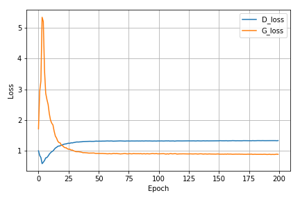

# GAN model on MNIST dataset 

# Documentation of Parameters
    
    Run "python train.py"
    
    The following arguments are configuration hyperparameters for train: 
      --train               training indicator if it is False then images will be generated from random inputs [False]
      --epochs              number of training epochs [200]
      --lr_rate             training learing rate for Adam optimizer [0.0002]
      --batch_size          number of training batch size [128]
      --keep_prob           dropout parameter for descriminator network [0.3]
      --restoring_epoch     number of epoch for restoring learning parameters [200]
      --random_dim          random input dimension[100]

Generated images and training history are saved in the **results** directory and learning parameters are saved in the **models** directory.

* Training loss
 * GAN

